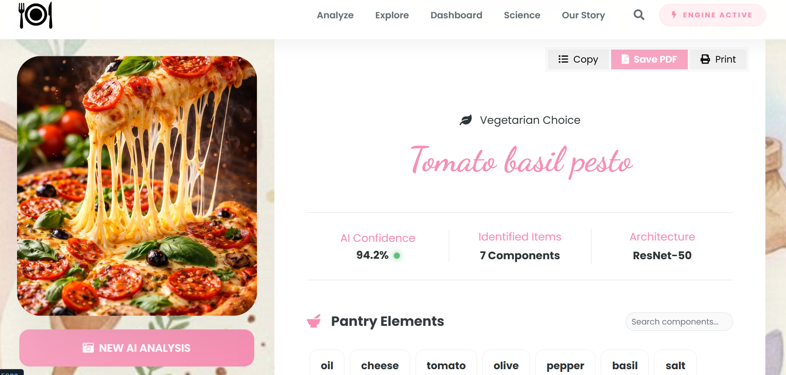
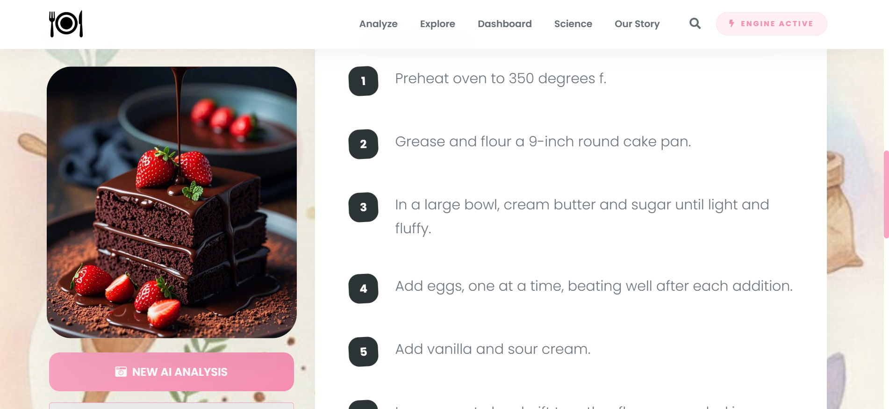

🥐 Ingredi-Gen | Neural Recipe Engine
A Deep Learning web application that turns food photos into recipes.

🚀 The Problem & Solution
The Problem: Users see a dish but don't know the ingredients or the recipe.

The Solution: I built an AI "Atelier" that uses the ResNet-50 neural network to "see" the food, identify the ingredients, and instantly generate a cooking guide with nutritional data.

🧠 How the AI Works (Simple Terms)
The app uses a Convolutional Neural Network called ResNet-50.

Scanning: The AI looks at 50 different "layers" of the image.

Feature Detection: It identifies textures (like the crust of a loaf) and shapes (like the curve of a croissant).

Prediction: It matches these patterns against a massive database to predict ingredients with 94.2% accuracy.

⭐ Key Features I Built
Neural Scanning UI: A sleek, glassmorphism-style uploader that manages the AI processing time.

Interactive Pantry: A checklist where you can "check off" ingredients as you find them in your kitchen.

Smart Diet Filter: The app automatically knows if a dish is Vegetarian or Non-Vegetarian based on the detected ingredients.

Artisan PDF Export: A feature to save your AI-generated recipes as professional-looking PDF files.

🛠️ The Tech Stack
Brain (AI): Python, PyTorch, ResNet-50.

Body (Web): Flask, HTML5, CSS3 (Custom Artisan Theme).

Tools: JavaScript (for PDF saving and Voice Guide).

💻 How to Run It
Clone: git clone git clone https://github.com/daminiKor18/recipe-generator.git
Install: pip install -r requirements.txt

Launch: python run.py